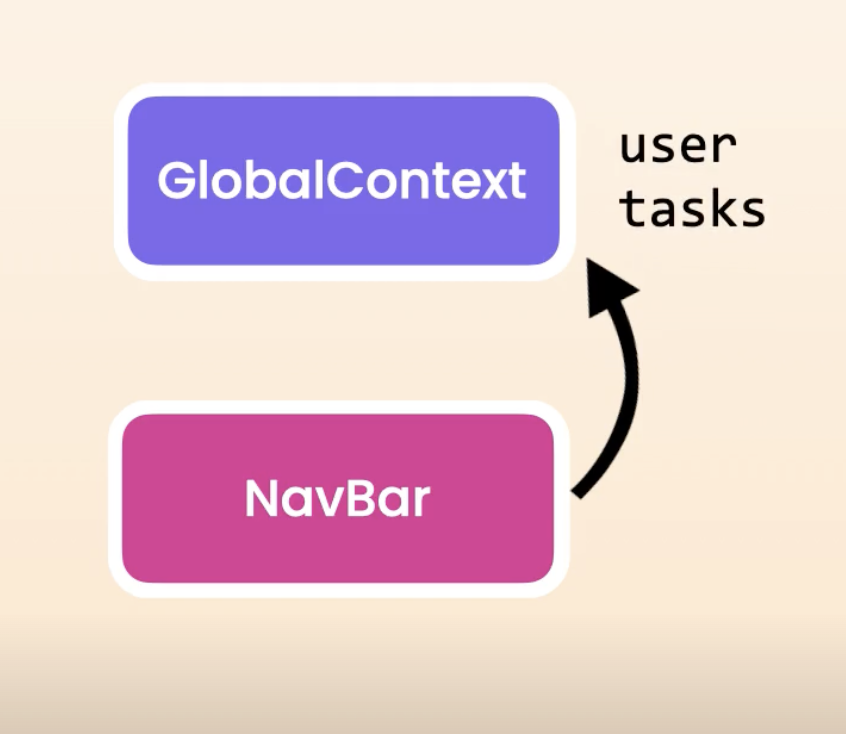
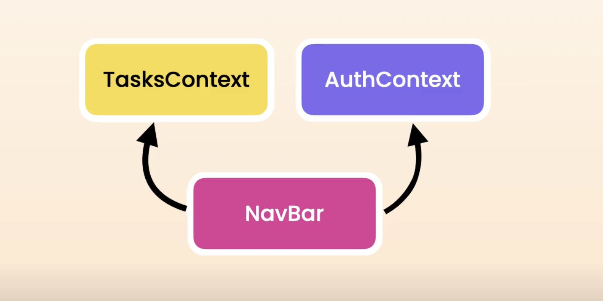
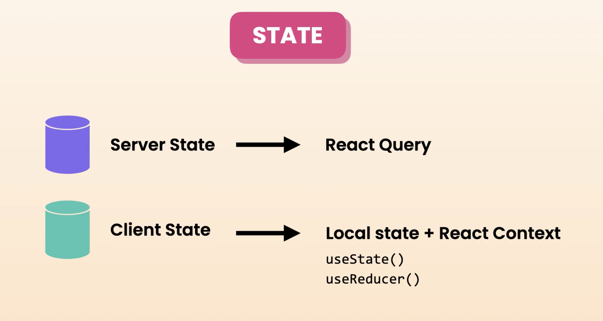
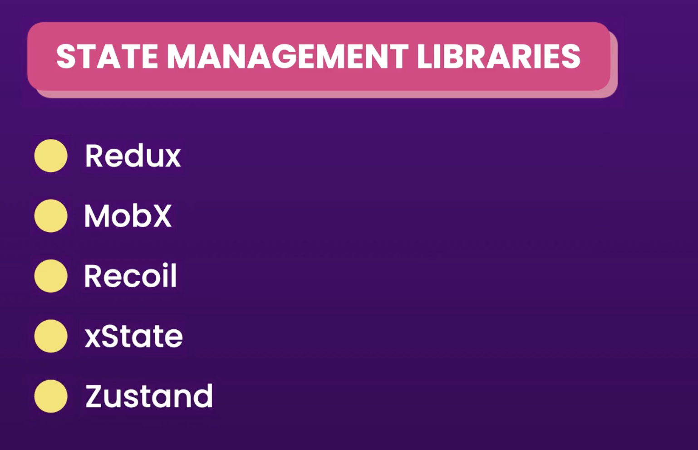
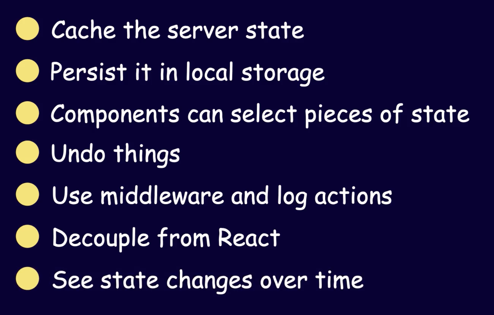
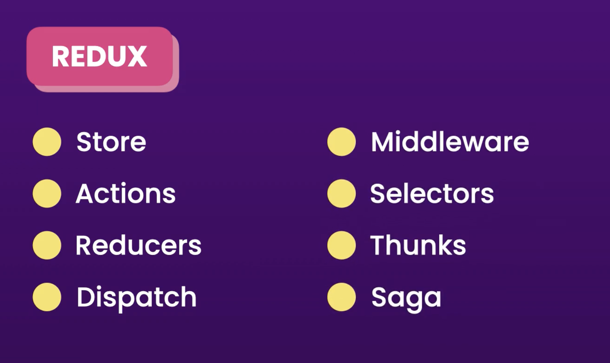
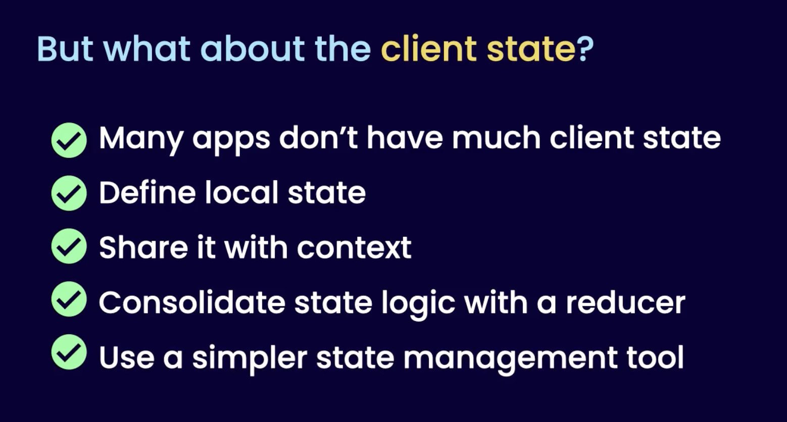

## Fetching and Updating Data with React Query

### Understanding the Application Layers


## Global State Management

### Sharing State using React Context

1. Lift state to closest parent
2. Create context to transport data (state, dispatch) & wrap component tree w/ provider for same data or st else
3. useContext hook to access

Folders:
hooks, reducers, context
When project become more complicated: separate into independent modules / functional areas e.g. counter, tasks

Keyboard:
Option, shift, Fn + F12 -> find all references
Option + Cmd + arrow: navigate tabs

Checks:
run app
and Cmd + Shift + P: build: npm build

### Splitting Context for Efficiency


Unnecessary renders if contexts are combined:


### When to use Context

Best to split context to avoid unnecessary re-renders

real-world, tasks would be in BED



If splitting up state doesn't make sense but deal with unnecessary renders, then use a library


### Context vs. Redux

Context doesn't have a way to store and update data but does prevent 'prop drilling'

Does context replace redux


Redux + Dev Tools

"give a fool a hammer and they will treat everything like a nail"
Don't think about tools as solutions

over focus on tools and features -> distracted from solution required


Understand problems ->

redux complex - not necessary


React Query simpler


Zustand for Client state -> mgmt tool last resort


## Routing

```typescript
<a href="/users">Users</a> // on the network tab this will cause a full page reload, not good
<Link to="/users">Users</Link> // no repeated requests b/c content already shipped, so don't need to return to server
```

Params are strings so need to parse to an int when required

'setSearchParams' has a side effect, component shoudl be pure
call inside event handler or effect only

Error logging service e.g. Sentry
