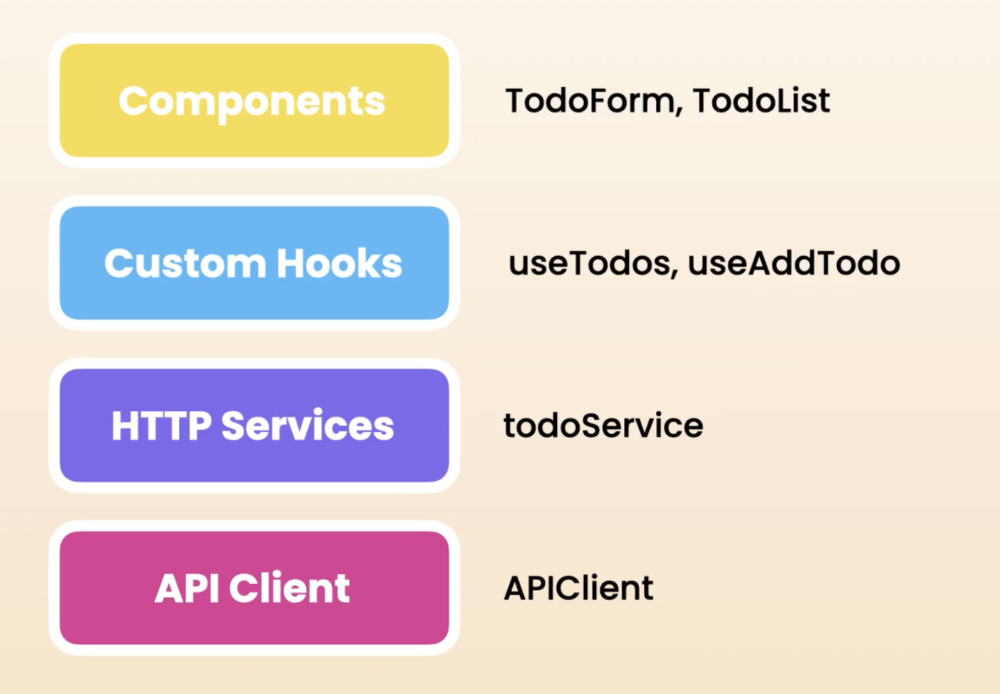

## Fetching and Updating Data with React Query

### Understanding the Application Layers

## Global State Management

### Sharing State using React Context

1. Lift state to closest parent
2. Create context to transport data (state, dispatch) & wrap component tree w/ provider for same data or st else
3. useContext hook to access

Folders:
hooks, reducers, context
When project become more complicated: separate into modules e.g. counter, tasks

Keyboard:
Option, shift, Fn + F12 -> find all references
Option + Cmd + arrow: navigate tabs

Checks:
run app
and Cmd + Shift + P: build: npm build
